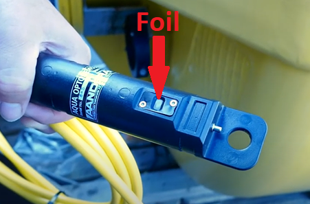
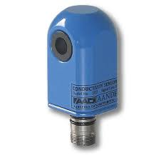

**Aanderaa oxygen optode 4531**

For å unngå unøyaktig data er det nødvendig å rengjøre sensoren med jevne mellomrom. Dette for å fjerne begroing og annet som kan påvirke målingen. Hvis det har oppstått skade på foilen, ta kontakt med JM Hansen for vedlikehold/utskiftning av sensor. Det anbefales å rengjøre sensorene ukentlig og ved behov. Behovet for rengjøring er sesongbasert.

**Video**

Youtube video tittel: *Aanderaa Oxygen Sensor – Cleaning Procedure*

<https://www.youtube.com/watch?v=QbJIPhidqp4>

**Rengjøring**

1.  Se videoen I lenken ovenfor.
2.  Plasser sensoren i en bøtte med temperert vann og såpe.
3.  Rengjør sensoren. Foilen må rengjøre **forsiktig** med tannbørste/Q-tips.
4.  Skyll av sensoren med rent temperert vann.
5.  Tørk av sensoren med tørt papir. (**NB!** Vær forsiktig med foilen)

Hvis sensoren er veldig skitten/begrodd, kan det være aktuelt å legge sensoren i en eddikløsning over natten (minst 12 timer, avhengig av begroing). Deretter følge stegene beskrevet ovenfor.

**Aanedraa Conductivity sensor 4319**

Når sensoren blir benyttet i øvre vannregionen er den særlig utsatt for begroing, dette begrenser nøyaktigheten over tid. Ved å utføre jevnlig vedlikehold vil du minimalisere risikoen for unøyaktig data.

Det anbefales å rengjøre sensorene ukentlig og ved behov. Behovet for rengjøring er sesongbasert.

**Rengjøring**

1.  Plasser sensoren i en bøtte med temperert vann og såpe.
2.  Rengjør sensoren, benytt Q-tips for å rengjøre hullet.
3.  Skyll av sensoren med rent temperert vann.
4.  Tørk av sensoren med tørt papir.

Hvis sensoren er veldig skitten/begrodd, kan det være aktuelt å legge sensoren i en eddikløsning over natten (minst 12 timer, avhengig av begroing). Deretter følge stegene beskrevet ovenfor.

